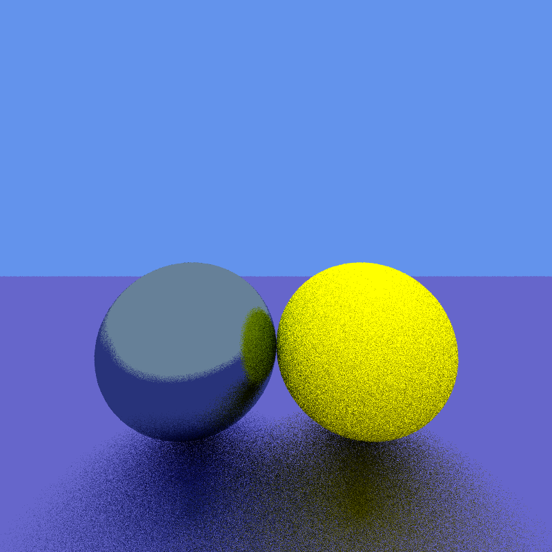

# Ray Tracer

A C++ ray tracing implementation featuring multiple rendering modes including traditional **Ray Tracing** and **Mandelbrot Set Generation**.

## Overview

This project implements a ray tracing engine capable of rendering 3D scenes with various materials and lighting effects. The implementation includes support for spheres, floors, and multiple material types including Lambertian diffuse surfaces, metallic reflections, and dielectric materials for glass-like objects. Additionally, the project includes a separate Mandelbrot set generator for mathematical visualization.

The ray tracer uses a recursive ray casting algorithm with configurable depth limits and supports multiple rays per pixel for anti-aliasing. The rendering pipeline processes scenes defined through a simple object-oriented interface and outputs BMP images.

## Codebase

### Dependencies

- CMake 3.20 or higher
- C++17 compatible compiler
- Google Test (automatically downloaded via CMake)
- nlohmann/json (automatically downloaded via CMake)

### Project Structure

```
ray-tracer/
├── src/
│   ├── lib/                    # Core library components
│   │   ├── materials/          # Material system implementations
│   │   │   ├── cubemap.h       # Environment mapping
│   │   │   ├── dielectric.h    # Glass and transparent materials
│   │   │   ├── lambertian.h    # Diffuse materials
│   │   │   ├── lambertian_texture.h  # Textured diffuse materials
│   │   │   ├── metal.h         # Metallic materials
│   │   │   └── material.h      # Base material interface
│   │   ├── shapes/             # Geometric primitives
│   │   │   ├── floor.h         # Floor plane implementation
│   │   │   ├── object.h        # Base object interface
│   │   │   └── sphere.h        # Sphere primitive
│   │   ├── util/               # Utility classes
│   │   │   ├── vec3.h          # 3D vector mathematics
│   │   │   ├── complex.h       # Complex number operations
│   │   │   └── random_utils.h  # Random number generation
│   │   ├── camera.h            # Camera and ray generation
│   │   ├── image.h             # BMP image generation
│   │   └── scene.h             # Scene management
│   └── program/
│       ├── ray-tracer.cpp      # Main ray tracing application
│       └── mandelbrot.cpp      # Mandelbrot set generator
├── examples/
│   └── mandelbrot.json         # Mandelbrot configuration file
├── assets/                     # README images and assets
├── test/
│   └── tests.cpp               # Unit tests for vector operations
└── out/                        # Build output directory
```

#### Structure Descriptions

- **Materials System**: Implements various surface materials with different scattering behaviors. The base `Material` class provides reflection and refraction utilities, while derived classes implement specific material properties.
- **Shapes System**: Provides an abstract interface for geometric primitives. Currently supports spheres and floor planes, with extensible design for additional shapes.
- **Camera System**: Handles ray generation and camera positioning with configurable screen dimensions and sampling parameters.
- **Image Generation**: Implements BMP file output with support for various color depths and grayscale modes.

### Architecture

The ray tracer follows a modular architecture with clear separation between geometric primitives, materials, and rendering logic. The main rendering loop iterates through screen pixels, generates multiple rays per pixel for anti-aliasing, and traces each ray through the scene using recursive ray casting.

The material system uses polymorphism to handle different surface interactions, with each material implementing its own scattering function. The shapes system provides a unified interface for intersection testing and normal calculation across different geometric primitives.

## Usage

### Building the Project

```bash
mkdir build && cd build
cmake ..
cmake --build . --config Release
```

### Running the Ray Tracer

The main ray tracer executable generates a scene with two spheres and a floor:

```bash
./src/program/ray-tracer.exe
```

This will output a BMP file named `my_file.bmp` in the build directory. The scene includes:
- A yellow diffuse sphere
- A metallic steel sphere  
- A reflective floor plane

### Running the Mandelbrot Generator

The Mandelbrot set generator creates mathematical visualizations:

```bash
./src/program/mandelbrot.exe
```

This generates `mandelbrot.bmp` with a high-resolution view of the Mandelbrot set using a custom color palette. The generator reads configuration parameters from `examples/mandelbrot.json`, allowing you to customize the center point, zoom level, resolution, and other rendering parameters without recompiling.

### Configuration

**Mandelbrot Generator**: Parameters can be configured via `examples/mandelbrot.json`:
- `center`: Complex plane coordinates for the center point
- `zoom`: Magnification level
- `width`: Output image width
- `aspect_ratio`: Image aspect ratio
- `max_iterations`: Maximum iteration count for convergence testing
- `escape_boundary_squared`: Escape radius for divergence detection
- `output_path`: Output file path

**Ray Tracer**: Key parameters can be modified in the source files:
- **Camera settings**: Screen resolution, rays per pixel, recursion depth
- **Scene objects**: Position, size, and material properties
- **Rendering effects**: Background colors, shading thresholds, grayscale mode

*Note: JSON configuration for the ray tracer is planned for future releases.*

---



*A steel ball and a yellow Lambertian ball on a purple metallic surface*

---


*Mandelbrot visualisation centered at (0.16125, 0.63744) with 100x zoom. Uses smooth shading and periodic coloring.*

---

### Testing

Run the test suite to verify vector mathematics:

```bash
./test/tests.exe
```
