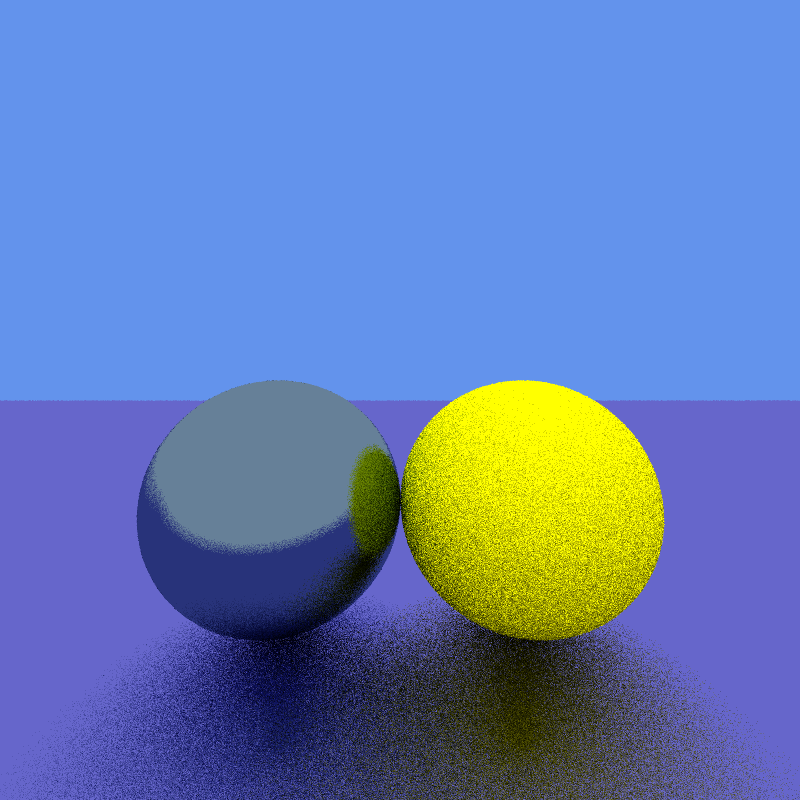

# Ray Tracer

A C++ ray tracing implementation featuring multiple rendering modes including traditional **Ray Tracing** and **Mandelbrot Set Generation**.

## Overview

This project implements a ray tracing engine capable of rendering 3D scenes with various materials and lighting effects. The implementation includes support for spheres, floors, and multiple material types including Lambertian diffuse surfaces, metallic reflections, dielectric materials for glass-like objects, and cubemap-textured surfaces. Additionally, the project includes a separate Mandelbrot set generator for mathematical visualization. The rendering phases for both the ray tracer and mandelbrot set generator run in parallel, with the maximum number of threads available on the device.

The ray tracer uses a recursive ray casting algorithm with configurable depth limits and supports multiple rays per pixel for anti-aliasing. The rendering pipeline processes scenes defined through a simple object-oriented interface and outputs BMP images.

## Codebase

### Dependencies

- CMake 4.2 or higher
- C++23 compatible compiler
- Google Test v1.17.0 (automatically downloaded via CMake)
- nlohmann/json v3.12.0 (automatically downloaded via CMake)

### Project Structure

The code is split into three libraries (`common`, `raytracer`, `mandelbrot`) and an `apps`
directory that holds the executable entry points. Every library follows the same layout, with
public headers under `include/<name>/` and implementation under `src/`. All code is under the
`raytracer::` namespace (`raytracer::common`, `raytracer::raytracer`, `raytracer::mandelbrot`).

```
ray-tracer/
├── common/                          # Shared library (raytracer::common)
│   ├── include/common/
│   │   ├── util/
│   │   │   ├── vec3.h               # 3D vector mathematics
│   │   │   ├── point.h              # 2D point type
│   │   │   ├── complex.h            # Complex number operations
│   │   │   ├── random_utils.h       # Random number generation
│   │   │   └── terminal.h           # Terminal progress output
│   │   └── image.h                  # BMP image generation
│   ├── src/                         # Implementations for the above
│   └── test/
│       └── util/test_vec3.cpp       # Unit tests for vector operations
├── raytracer/                       # Ray tracing library (raytracer::raytracer)
│   ├── include/raytracer/
│   │   ├── materials/
│   │   │   ├── material.h           # Base material interface
│   │   │   ├── lambertian.h         # Diffuse materials
│   │   │   ├── lambertian_texture.h # Textured diffuse materials
│   │   │   ├── metal.h              # Metallic materials
│   │   │   ├── dielectric.h         # Glass and transparent materials
│   │   │   └── cubemap.h            # Environment mapping
│   │   ├── shapes/
│   │   │   ├── object.h             # Base object interface
│   │   │   ├── sphere.h             # Sphere primitive
│   │   │   └── floor.h              # Floor plane implementation
│   │   ├── camera.h                 # Camera and ray generation
│   │   └── scene.h                  # Scene management
│   ├── src/                         # Implementations for the above
│   └── data/
│       └── texture.bmp              # Texture asset
├── mandelbrot/                      # Mandelbrot library (raytracer::mandelbrot)
│   ├── include/mandelbrot/
│   │   └── scene.h                  # Mandelbrot scene configuration
│   └── test/
│       └── test_json.cpp            # Config parsing tests
├── apps/
│   ├── raytracer.cpp                # Ray tracing executable entry point
│   └── mandelbrot.cpp               # Mandelbrot generator entry point
├── examples/
│   └── mandelbrot.json              # Mandelbrot configuration file
├── assets/                          # README images
│   ├── raytracer.bmp
│   └── mandelbrot.bmp
├── CMakeLists.txt                   # Top-level build configuration
└── CMakePresets.json                # Configure/build presets
```

#### Structure Descriptions

- **Materials System**: Implements various surface materials with different scattering behaviors. The base `Material` class provides reflection and refraction utilities, while derived classes implement specific material properties.
- **Shapes System**: Provides an abstract interface for geometric primitives. Currently supports spheres and floor planes, with extensible design for additional shapes.
- **Camera System**: Handles ray generation and camera positioning with configurable screen dimensions and sampling parameters.
- **Image Generation**: Implements BMP file output with support for various color depths and grayscale modes.

### Architecture

The ray tracer follows a modular architecture with separation between geometric primitives, materials, and rendering logic. The main rendering loop iterates through screen pixels, generates multiple rays per pixel for antialiasing, and traces each ray through the scene using recursive ray casting. This loop is run over multiple parallel threads.

The material system uses polymorphism to handle different surface interactions, with each material implementing its own scattering function. The shapes system provides a unified interface for intersection testing and normal calculation across different geometric primitives.

## Usage

### Building the Project

The project uses CMake presets (Ninja generator). Configure and build a release preset:

```bash
cmake --preset x64-release
cmake --build out/build/x64-release
```

Available configure presets: `x64-debug`, `x64-release`, `x86-debug`, `x86-release`. Build
output is placed under `out/build/<preset>/`.

### Running the Ray Tracer

The ray tracer executable generates a scene with three spheres and a floor:

```bash
./out/build/x64-release/apps/raytracer.exe
```

This will output a BMP file named `raytracer.bmp` in the build directory. The scene includes:
- A yellow diffuse (Lambertian) sphere
- A metallic sphere
- A large cubemap-textured sphere in the background
- A reflective metallic floor plane

### Running the Mandelbrot Generator

The Mandelbrot set generator creates mathematical visualizations:

```bash
./out/build/x64-release/apps/mandelbrot.exe
```

This generates `mandelbrot.bmp` with a high-resolution view of the Mandelbrot set using a custom
16-color palette and smooth (normalized iteration count) shading. The generator reads configuration parameters from `examples/mandelbrot.json`, allowing you to customize the center point, zoom level, resolution, and other rendering parameters without recompiling.

### Configuration

**Mandelbrot Generator**: Parameters are configured via `examples/mandelbrot.json`:
- `center`: `{ "x", "y" }` coordinates of the center point on the complex plane
- `zoom`: Magnification level
- `width`: Output image width in pixels (height is derived from `aspect_ratio`)
- `aspect_ratio`: Image aspect ratio
- `max_iterations`: Maximum iteration count for convergence testing
- `escape_boundary_squared`: Squared escape radius for divergence detection
- `output_path`: Output file path

**Ray Tracer**: Key parameters can be modified directly in `apps/raytracer.cpp`:
- **Camera settings**: Screen resolution, rays per pixel, recursion depth, view type
- **Scene objects**: Position, size, and material properties
- **Rendering effects**: Background/sky colors, shading thresholds, grayscale mode

*Note: JSON configuration for the ray tracer is planned for future releases.*

---



*A metallic ball and a yellow Lambertian ball on a purple metallic surface*

---


*Mandelbrot visualisation centered at (0.16125, 0.63744) with 100x zoom. Uses smooth shading and periodic coloring.*

---

### Testing

Tests are built alongside the project and registered with CTest. Run the full suite with:

```bash
ctest --test-dir out/build/x64-release
```

Or run an individual test executable directly, e.g.:

```bash
./out/build/x64-release/common/test/raytracer-common-test.exe
./out/build/x64-release/mandelbrot/test/raytracer-mandelbrot-test.exe
```
